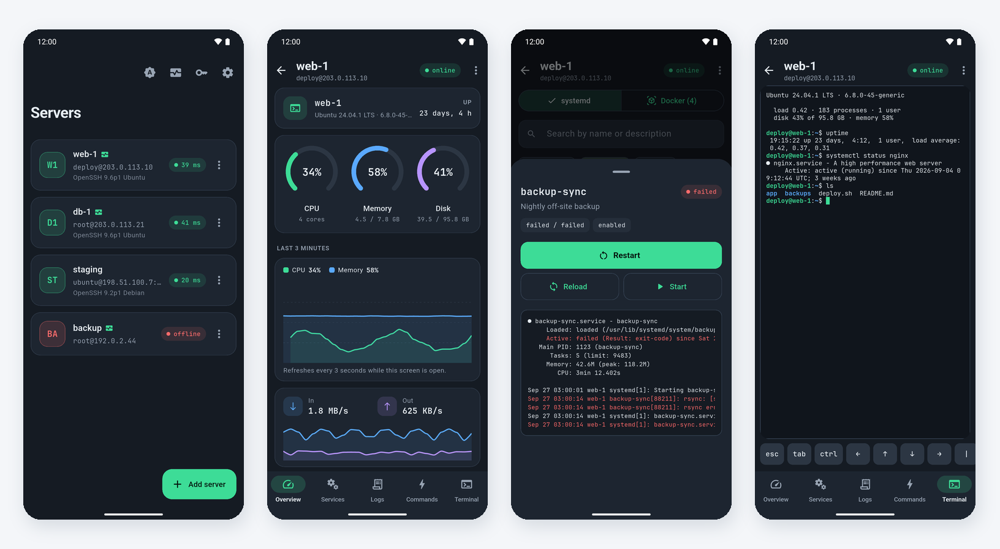
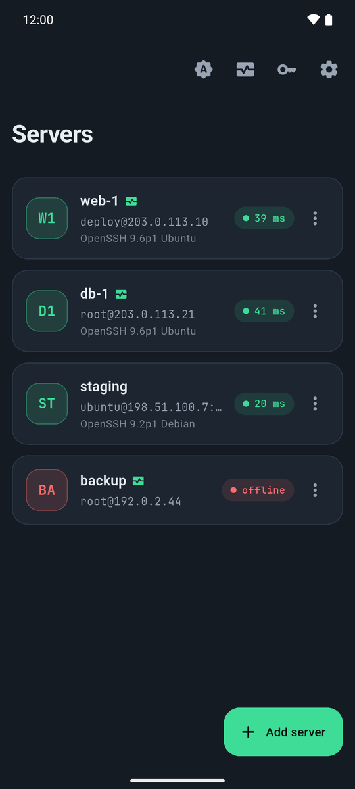
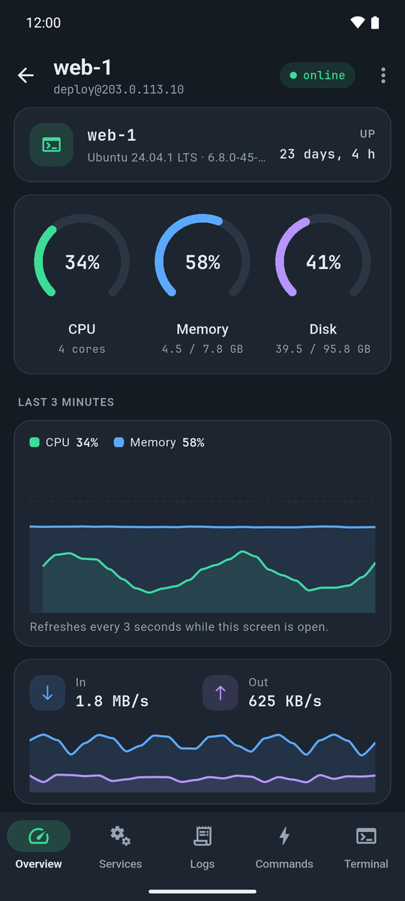
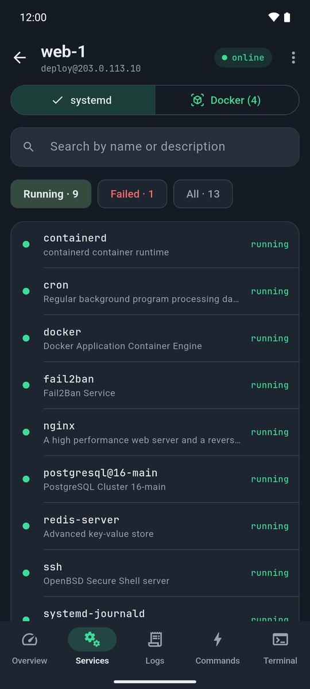
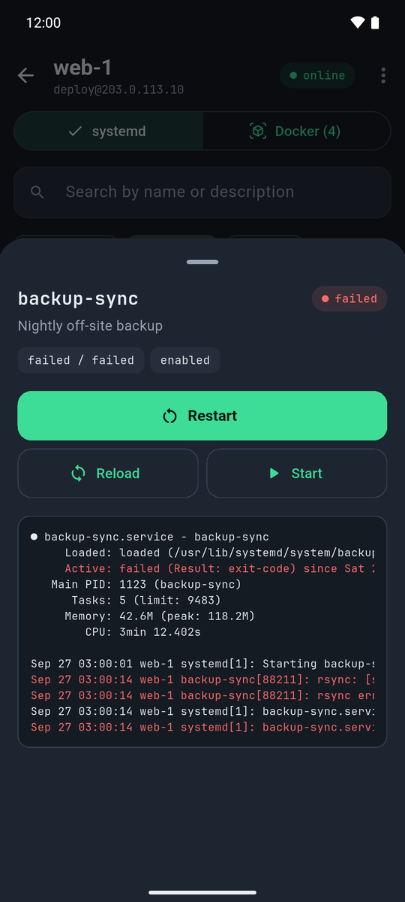
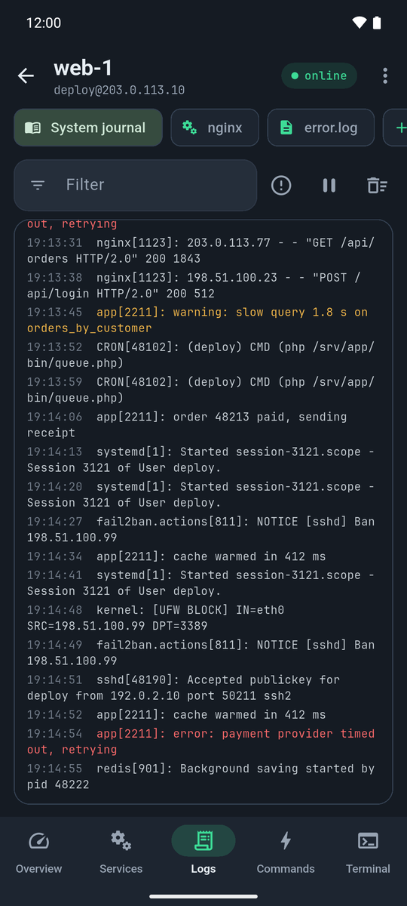
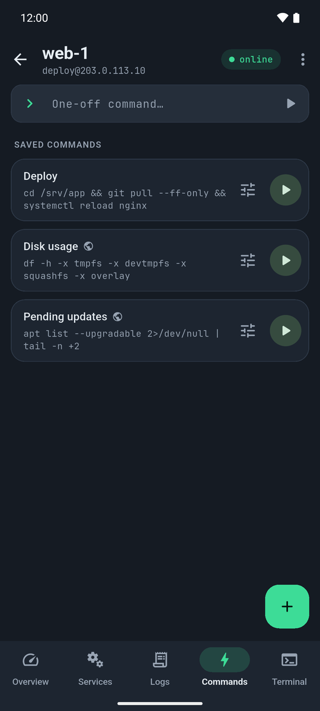
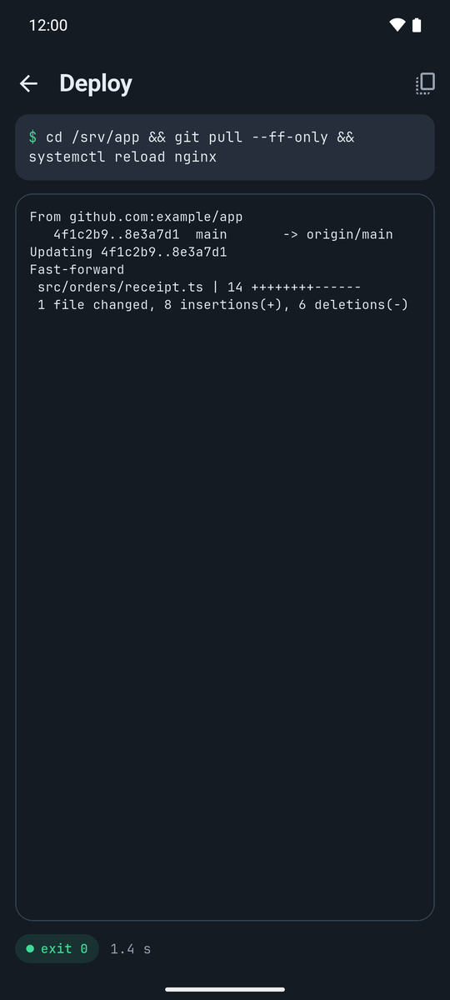
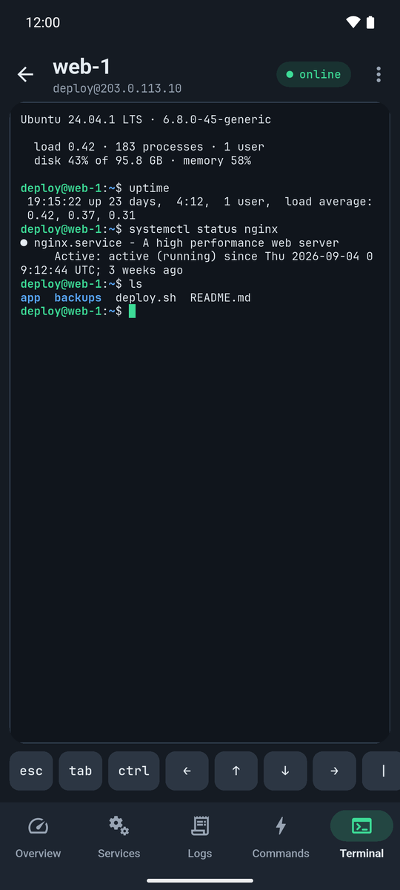
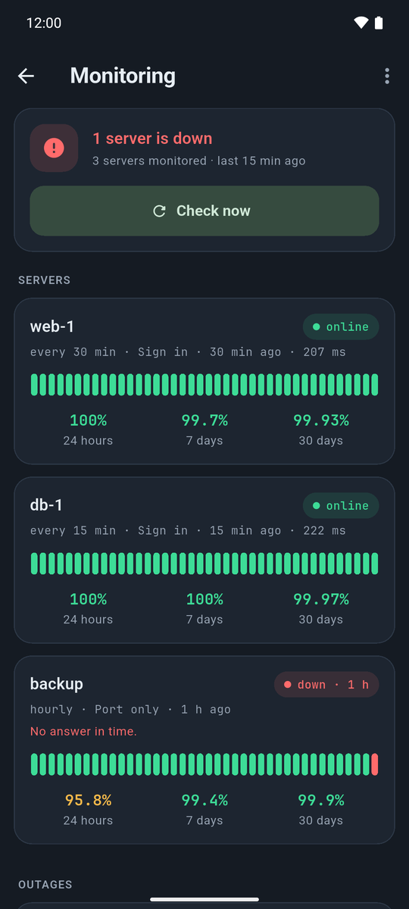

# ServerDeck

Your Linux servers, from your phone, over plain SSH.

ServerDeck looks after a handful of servers from a phone: how they are doing,
which services are up, what the logs say, and the one command that has to run
right now. It talks to each server over SSH and nothing else, so there is no
agent to install, no port to open and no account anywhere: the phone signs in
the way `ssh` from a laptop would, runs ordinary commands (`cat /proc/…`,
`systemctl`, `journalctl`, `docker ps`) and reads what they print.



Written in Flutter, in a graphite and mint theme of its own, light, dark or
following the phone, switched from the server list, with JetBrains Mono for
anything a server prints. Built and tested on Android;
the same code compiles for iOS, and CI builds it on every push.

## What it does

### Servers

- **The list** knocks on each server's SSH port and shows how long the
  connection took and which SSH server answered (`OpenSSH 9.6p1 Ubuntu`), or
  that nothing did. It knocks once per run and on pull to refresh, not every
  time the list comes back: fail2ban in its stricter modes counts connections
  closed before signing in.
- **Adding one** takes an address, a user, a port and a key or a password.
- **Opening one** signs in and keeps the connection while its screen is open.
  When it drops (a network change, a server restart, the phone asleep) the
  screen says so and reconnects with a tap. A failure says what failed: the
  address, a timeout, a refused key, a changed host key.

### Overview

One command every three seconds, while the screen is on and the app in front,
reads `/proc`, `df` and `os-release`:

- CPU, memory and the root disk as rings, turning amber and then red as they
  fill up;
- the last three minutes of CPU and memory as a chart;
- network in and out per second;
- the load over 1, 5 and 15 minutes, coloured against the number of cores;
- every disk, and swap;
- the host name, distribution, kernel and uptime.

### Services

- **systemd units**, running, failed or all, searched by name or description.
  A tap opens one with its `systemctl status` and last journal lines, errors in
  red.
- **Restart, reload, stop, start**, each asking first and showing the exact
  command it will run. A user other than root goes through `sudo -n`, and a
  sudo that wants a password is explained instead of left hanging.
- **Docker containers**, when Docker is installed: their state and health,
  their last log lines, and restart, stop and start.

### Logs

- The **system journal**, a **service's journal** or a **log file**, followed
  live (`journalctl -f`, `tail -F`), with the last 200 lines to start.
- Errors in red, warnings in amber, a filter, an errors-only switch, and a pause
  that holds new lines back behind a button.
- Journal lines show only the time of day; the date and host name every line
  repeats are left out.
- Sources are saved per server.

A followed command stops on the server when the tab is left. sshd neither
passes signals nor hangs up a command without a terminal, so a bare
`journalctl -f` would run on until it next wrote to the closed pipe, which for
a quiet log is never; ServerDeck runs it under a small `sh` wrapper that kills
it once the channel's input ends.

### Commands

- **Saved commands**, per server or shared by all of them, a tap away, each
  asking before it runs if it should.
- **A one-off command** from a field at the top.
- A run shows the command, its output as it arrives, the time taken, a stop
  button and the exit code.
- With nothing saved yet, eight read-only starters are offered: disk usage, the
  biggest folders, pending updates, who is logged in, the Apache and Nginx
  config tests, the top processes and the listening ports.

### Terminal

An interactive shell on an `xterm-256color` pseudo-terminal, kept open while
the server's screen is. Above the keyboard is the row of keys a phone does not
have: esc, tab, a sticky ctrl (ctrl, then c, is ^C), the arrows, home, end,
page up and down, `|`, `/`, `-`, `~`, the font size and paste.

### Monitoring

Any server can be watched in the background, and ServerDeck says when it goes
down and when it is back:

- **Every 15 minutes to 6 hours**, per server. Android runs background work at
  most every 15 minutes, and ServerDeck asks for it only with a network, so a
  phone in a tunnel does not report every server down.
- **By signing in** over SSH and running `true`, which also shows the key still
  works and is never counted by fail2ban; or **by the port only**, for a server
  with nothing to sign in with.
- **No alarm for a blip**: a failed check is tried again after 30 seconds
  before it counts.
- **No alarm for the phone's own network**: when a check still cannot reach a
  server, ServerDeck opens (and at once closes, sending nothing) a connection
  to 1.1.1.1, 8.8.8.8 or 9.9.9.9. If none of them answers either, the phone is
  the one offline, and the check is skipped rather than logged as an outage.
- **A notification when the state changes**, not at every check: down and why,
  back up and how long it was down (replacing the first), and a separate alarm
  when a server shows a different host key.
- **The monitoring page** sums it up and checks everything on request; per
  server it shows the state, the last check and its latency, the last 40
  checks as a strip, and uptime over 24 hours, 7 days and 30 days, worked out
  from the time spent down; then the outages, with when, how long and why.
  An outage that was not one can be deleted with a long press. Thirty days of
  checks and the last 500 outages are kept.

A background check cannot ask about a host key, so a server has to be opened
once in the app, and its key accepted, before signing in can be monitored.
On iOS the system decides when background work runs, and it may be rare.

### Keys and security

- **Keys** are Ed25519, made on the phone, or pasted in: OpenSSH, RSA (PKCS#1)
  or ECDSA, a protected one unlocked once with its passphrase, which is not
  kept. The public half is a tap away to copy.
- **Installing a key**: when a server turns the key down, ServerDeck offers to
  sign in once with the password, which it does not keep, and add the key to
  `~/.ssh/authorized_keys` (once, with `~/.ssh` at 700 and the file at 600).
- **Private keys and passwords** live in the Android Keystore or the iOS
  Keychain. Everything else is a JSON file in the app's private storage,
  replaced atomically. App backups are off, since a restored file would come
  back without its secrets.
- **Host keys** are shown with their fingerprint the first time, together with
  the command that prints the same fingerprint on the server, and kept once
  accepted. A different key later stops the connection and shows both
  fingerprints; forgetting the old one is a separate, deliberate step in the
  settings.
- **App lock**: optionally, the phone's fingerprint, face or PIN at start and
  after a minute in the background.
- ServerDeck **collects nothing** and talks to nothing but your servers.

### Languages

Hungarian, English, German, Spanish and French. The app follows the phone's
language, or the one picked under Settings → Language; background
notifications come in the same language.

## Screens

| Servers | Overview | Services |
|---|---|---|
|  |  |  |

| A failed service | Logs | Saved commands |
|---|---|---|
|  |  |  |

| A command running | Terminal | Monitoring |
|---|---|---|
|  |  |  |

The pictures are of the demo build (below): the servers, addresses and output
are invented.

## Installing it

### Android

1. Download an APK from the
   [releases](https://github.com/szabolevi98/serverdeck/releases) page:
   `serverdeck-*-arm64.apk` for practically every phone of the last years
   (smaller), or `serverdeck-*-universal.apk`, which runs on any of them.
2. Install it on the phone. The first time, Android asks to allow apps from
   unknown sources.
3. Add a server, generate a key, and put its public half on the server, by
   hand or with **Install the key with a password**.

It needs **Android 7.0 (API 24)** or later. Updates install over the old
version; stay with the same kind of APK, arm64 or universal.

### iOS

Each release also has `serverdeck-*-ios-unsigned.ipa`, built by GitHub Actions
on a Mac runner. It is not signed, since that takes a paid Apple developer
account, so it is for sideloading: AltStore, SideStore or Sideloadly sign it
with your own Apple ID when they install it. With a free Apple ID the
signature lasts 7 days and has to be renewed, and at most three such apps can
be installed at a time. It needs **iOS 15** or later.

The iOS build compiles on every push but has not been tried on an iPhone yet.

### The server

The server needs SSH and, for the overview, Linux; services need systemd,
logs need `journalctl` or `tail`.

## Trying it without a server

The demo build has four invented servers, on the addresses RFC 5737 keeps for
documentation, whose stats, services, containers, logs, commands and shell
answer like real ones, with no network at all:

```
flutter run --dart-define=SERVERDECK_DEMO=true
```

## Building it

| Layer | |
|---|---|
| Language, UI | Dart 3.13, Flutter 3.47, Material 3 |
| SSH | dartssh2; keys with pinenacl |
| Terminal | xterm |
| State | Riverpod 3 |
| Storage | flutter_secure_storage (Keystore, Keychain) and a JSON file |
| Charts | fl_chart |
| Background | workmanager (WorkManager, BGTaskScheduler), flutter_local_notifications |

```
flutter pub get
flutter run                  # on a phone or emulator
flutter test                 # parsers, keys, storage, monitoring, the app lock, the sh wrapper
flutter analyze
flutter build apk --release  # signed when android/key.properties exists
```

The parsers are tested on the real output of an Ubuntu 24.04 server, the key
code against keys made by `ssh-keygen` and their fingerprints, and the stop
wrapper and the key installer against a real `sh`.

A signed release build needs `android/key.properties` (never committed):

```properties
storeFile=C:/path/to/release.jks
storePassword=...
keyAlias=serverdeck
keyPassword=...
```

Without it, `flutter build apk --release` makes an unsigned APK.

### Layout

```
lib/
  data/      what is remembered: servers, keys, host keys, commands, log
             sources; the JSON file and the secure store
  ssh/       the connection, keys, host key checks, the session, the port knock
  probes/    the commands behind each screen and the parsers of their output
  monitor/   background checks, the outage log, notifications, the schedule
  ui/        the screens, the theme and shared widgets
  demo/      the invented servers of the demo build
  l10n/      Hungarian, English, German, Spanish and French
test/        unit and widget tests; fixtures from a real server and ssh-keygen
assets/      the icon and JetBrains Mono (OFL)
docs/        the cover and the screenshots
```

## License

[GNU AGPL-3.0](LICENSE). JetBrains Mono is under the SIL Open Font License, in
[assets/fonts](assets/fonts/JetBrainsMono-OFL.txt).
© 2026 [szabolevi98](https://github.com/szabolevi98)
